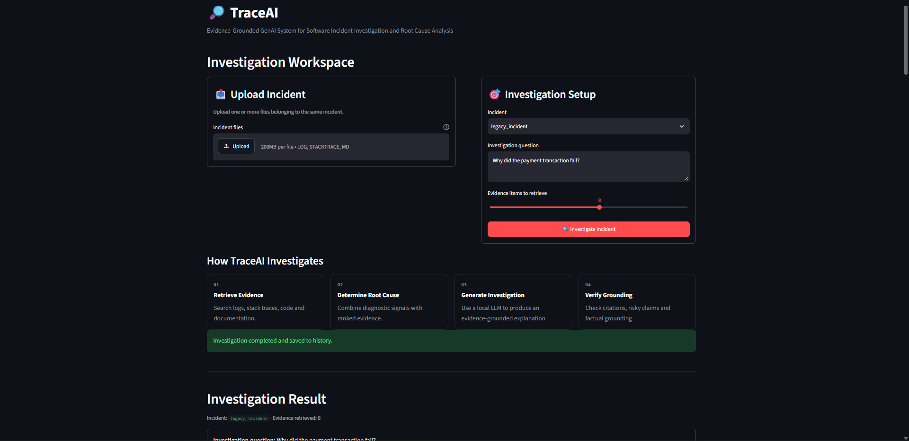
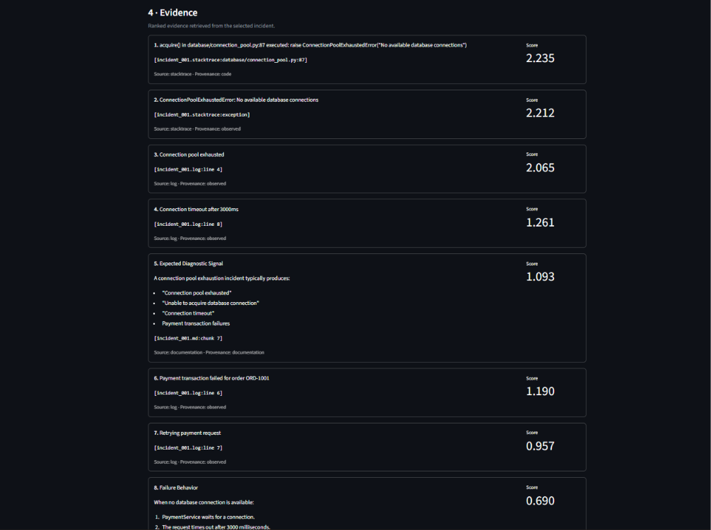
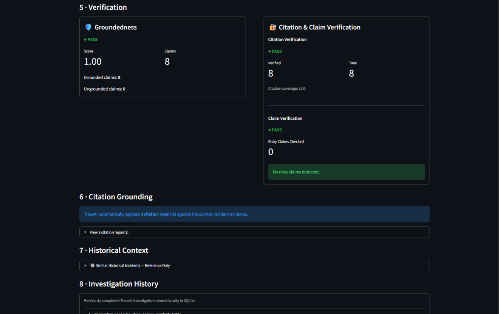

# TraceAI

## Evidence-Grounded GenAI System for Software Incident Investigation and Root Cause Analysis

TraceAI is a local, open-source GenAI system for investigating software incidents using application logs, stack traces, documentation, historical incidents, and source-level evidence.

Instead of relying only on an LLM-generated explanation, TraceAI retrieves relevant evidence first, performs deterministic root-cause analysis, generates an investigation using a local LLM, and then verifies the generated analysis against the retrieved evidence.

The goal is to make AI-assisted incident investigation **evidence-grounded, traceable, and reproducible**.

---

## Why TraceAI?

Traditional log analysis often requires engineers to manually correlate:

- Application logs
- Stack traces
- Source-code locations
- Documentation
- Previous incidents
- Failure patterns

A general-purpose LLM can summarize these sources, but an important engineering problem remains:

> How can we ensure that an AI-generated diagnosis is actually supported by the incident evidence?

TraceAI addresses this by separating the investigation into retrieval, deterministic analysis, generation, and verification stages.

---

## Core Pipeline

```text
Incident Data
     │
     â–¼
Multi-Source Loading
     │
     â–¼
Evidence Normalization
     │
     â–¼
Sentence-Transformer Embeddings
     │
     â–¼
FAISS Retrieval
     │
     â–¼
Evidence-Aware Ranking
     │
     ├──────────────► Diagnostic Signals
     │
     ├──────────────► Root-Cause Analysis
     │
     └──────────────► Historical Incident Matching
                              │
                              â–¼
                       RAG Context Builder
                              │
                              â–¼
                    Local Qwen2.5 1.5B
                         via Ollama
                              │
                              â–¼
                       AI Investigation
                              │
                              â–¼
                     Citation Repair
                              │
                              â–¼
                   Citation Verification
                              │
                              â–¼
                    Claim Verification
                              │
                              â–¼
                       Groundedness
                              │
                              â–¼
                    Evidence Confidence
                              │
                              â–¼
                       SQLite History
```

---

## Key Features

### Multi-Source Evidence Retrieval
TraceAI combines evidence from application logs, stack traces, documentation, source-level stack frames, and historical incidents. Evidence retains provenance and source-location information.

### Evidence-Aware Ranking
Retrieved evidence is ranked using semantic similarity, provenance, log severity, diagnostic signatures, root-cause relevance, failure indicators, stack-trace specificity, and evidence diversification.

### Deterministic Root-Cause Analysis
TraceAI contains diagnostic signatures for connection pool exhaustion, database connection timeout, API timeout, authentication failure, null pointer failure, memory exhaustion, network connectivity failure, storage failure, cache failure, Kafka failure, and configuration failure.

The root-cause support score is a **deterministic evidence-support heuristic**, not a statistical probability.

### Historical Incident Matching
Current incidents are compared with previous incidents using semantic similarity. Historical incidents are treated as reference evidence, not authoritative evidence.

### Local RAG with Qwen2.5
TraceAI uses Qwen2.5 1.5B Instruct through Ollama. No paid LLM API is required.

### Citation and Claim Verification
Generated citations are checked against retrieved evidence, while risky unsupported claims such as recovery, persistence, customer impact, revenue loss, data loss, and unsuccessful retries are checked before returning the investigation.

### Groundedness Verification
The generated investigation is evaluated against retrieved evidence using groundedness, citation coverage, and claim verification signals.

### Investigation History
Completed investigations are persisted in SQLite with investigation ID, incident ID, query, root cause, confidence, analysis, groundedness, citation coverage, claim coverage, and timestamp.

---

## Demo

### Investigation Workspace


### Root Cause & AI Investigation


### Evidence


### Verification

# Example Investigation

For the payment-service incident, TraceAI identifies:

```text
Root Cause:
Connection pool exhaustion

Confidence:
HIGH

Support Score:
1.0

Citation Coverage:
1.0

Groundedness:
1.0 / HIGH

Citation Verification:
PASS

Claim Verification:
PASS
```

Evidence chain:

```text
Connection pool exhausted
        ↓
Unable to acquire database connection
        ↓
Payment transaction failed
```

Relevant evidence can be traced to:

```text
incident_001.log
incident_001.stacktrace
incident_001.md
```

---

# Evaluation

TraceAI was evaluated on a synthetic benchmark containing:

```text
50 incidents
10 root-cause categories
5 incidents per category
Seed: 42
823 evidence items
55 incidents in the retrieval corpus
```

### Results

| Metric | TraceAI |
|---|---:|
| Root Cause Accuracy | 100.00% |
| Mean Precision@5 | 0.564 |
| Mean Recall@5 | 0.940 |
| MRR | 1.000 |

The benchmark also compared the evidence-ranking system against the earlier baseline:

| Metric | Baseline | TraceAI |
|---|---:|---:|
| Precision@5 | 0.344 | 0.564 |
| Recall@5 | 0.573 | 0.940 |
| MRR | 0.578 | 1.000 |

These measurements come from the project's synthetic evaluation dataset and should not be interpreted as production incident performance.

---

# Technology Stack

### Backend
- Python 3.12
- FastAPI
- Uvicorn
- Pydantic

### Retrieval
- Sentence Transformers
- `all-MiniLM-L6-v2`
- FAISS CPU
- NumPy

### GenAI
- Qwen2.5 1.5B Instruct
- Ollama
- Retrieval-Augmented Generation (RAG)

### Storage
- SQLite

### Deployment
- Docker
- Docker Compose

### Testing
- Pytest

---

# API

The TraceAI backend exposes a versioned REST API under `/api/v1`.

| Method | Endpoint | Purpose |
|---|---|---|
| GET | `/api/v1/health` | API health |
| GET | `/api/v1/incidents` | List loaded incidents |
| POST | `/api/v1/investigations` | Run an investigation |
| GET | `/api/v1/investigations` | List investigation history |
| GET | `/api/v1/investigations/{id}` | Get an investigation |
| DELETE | `/api/v1/investigations/{id}` | Delete an investigation |

Example investigation request:

```json
{
  "incident_id": "legacy_incident",
  "query": "Why did the payment transaction fail?",
  "top_k": 8
}
```

---

# Project Structure

```text
TraceAI/
├── api/
│   ├── __init__.py
│   └── main.py
├── app/
│   ├── analysis/
│   ├── parsers/
│   ├── retrieval/
│   ├── rag/
│   └── services/
├── data/
│   ├── incidents/
│   └── evaluation/
├── tests/
├── main.py
├── Dockerfile
├── docker-compose.yml
├── requirements.txt
├── requirements-docker.txt
├── pytest.ini
├── .dockerignore
└── README.md
```

---

# Running Locally

## 1. Clone

```bash
git clone https://github.com/akashanish11/TraceAI.git
cd TraceAI
```

## 2. Virtual Environment

```bash
python -m venv .venv
```

Windows:

```powershell
.venv\Scripts\Activate.ps1
```

## 3. Install Dependencies

```bash
pip install -r requirements.txt
```

## 4. Ollama

Make sure Ollama is installed and the model is available:

```bash
ollama pull qwen2.5:1.5b
```

Default local endpoint:

```text
http://localhost:11434
```

The endpoint can also be configured using:

```text
TRACEAI_OLLAMA_URL
```

## 5. Run API

```bash
uvicorn api.main:app --reload
```

API:

```text
http://127.0.0.1:8000
```

Health:

```text
http://127.0.0.1:8000/api/v1/health
```

---

# Docker

Build:

```bash
docker build -t traceai-api:test .
```

The image uses Python 3.12, CPU-only PyTorch, FAISS CPU, Sentence Transformers, and FastAPI.

---

# Docker Compose

Recommended containerized startup:

```bash
docker compose up
```

API:

```text
http://127.0.0.1:8000
```

The container connects to the Windows-hosted Ollama instance through:

```text
host.docker.internal:11434
```

Health check:

```powershell
Invoke-RestMethod http://127.0.0.1:8000/api/v1/health
```

Stop:

```bash
docker compose down
```

---

# Testing

Run:

```bash
pytest
```

Pytest markers include:

```text
ml
integration
```

---

# Design Principles

### Evidence before generation
Retrieve and rank evidence before asking the LLM to produce an investigation.

### Current evidence over historical evidence
Historical incidents provide context but are not authoritative evidence for the current incident.

### Deterministic analysis where possible
Root-cause detection and evidence scoring use deterministic signals before LLM generation.

### Verification after generation
The generated investigation is checked for citation validity, risky claims, and evidence groundedness.

### Local-first GenAI
The current architecture uses a local LLM through Ollama rather than a paid hosted API.

---

# Limitations

TraceAI is currently a research/prototype system rather than a production incident-management platform.

Current limitations include:

- Synthetic benchmark data
- Local LLM inference
- CPU-oriented execution
- Limited incident formats
- Heuristic root-cause confidence
- No live integration with production observability platforms
- No distributed vector database
- No multi-user authentication/authorization layer

Evaluation results demonstrate behavior on the implemented benchmark and do not guarantee production performance.

---

# Future Work

- Additional log and stack-trace formats
- AST and source-code analysis
- Tree-sitter based code parsing
- Larger local instruction models
- Reranking models
- Streaming investigation responses
- Production observability integrations
- Kubernetes deployment
- Authentication and role-based access
- Continuous evaluation pipelines
- Larger real-world incident datasets

---

# Author

**Akash Anish**

Integrated BCA-MCA  
Amrita Vishwa Vidyapeetham, Kochi

---

## Project Status

**Active development**

TraceAI currently provides:

- Multi-source evidence retrieval
- Evidence-aware ranking
- Deterministic root-cause analysis
- Historical incident matching
- Local RAG
- Qwen2.5 1.5B inference
- Citation verification
- Claim verification
- Groundedness evaluation
- Investigation persistence
- FastAPI REST API
- Docker
- Docker Compose
- Automated tests
